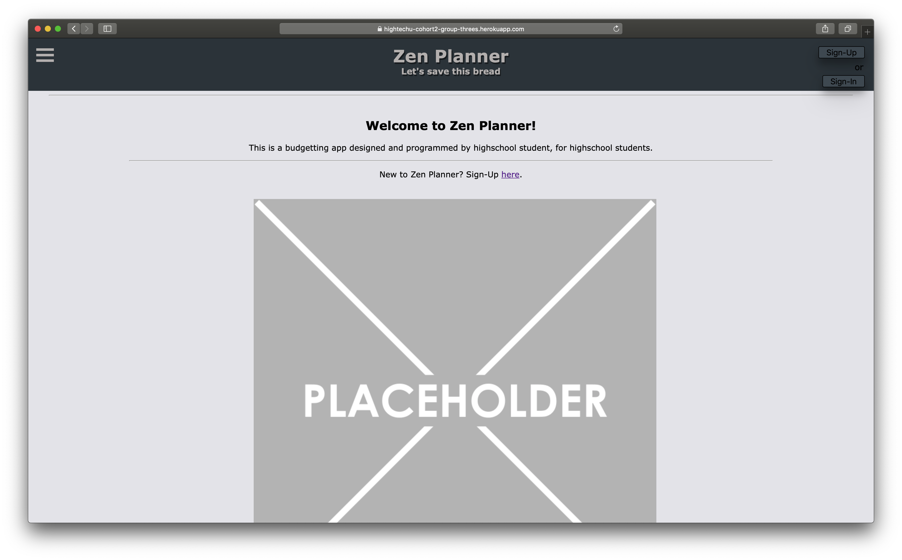
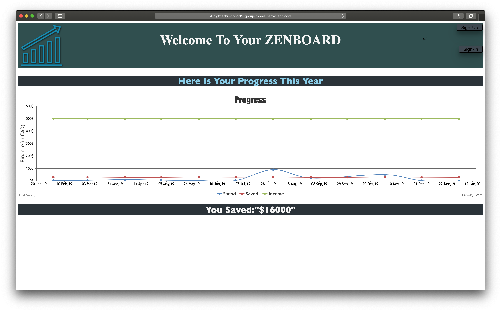
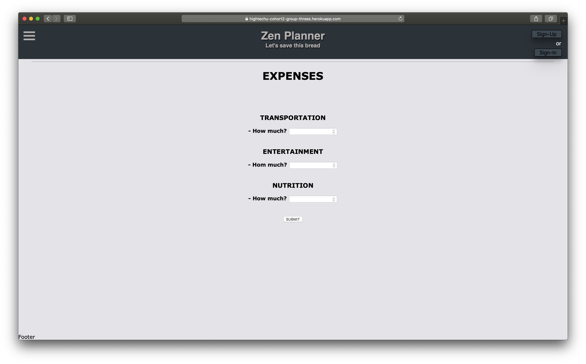
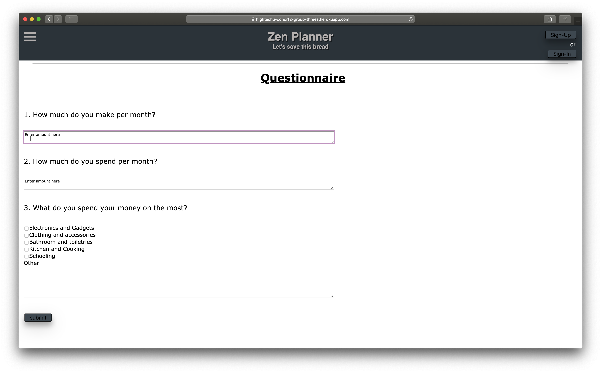

# Zen Planner: Let's Save This Bread

**2019 HighTechU Academy - Cohort 2**

## Website

https://zenplanner.herokuapp.com

## Mini Pitch

This is a financial planner for students (Grade 9-12) who are new to rearranging their money.

## Problem Statment

Teenagers are terrible spenders and cannot find ways to save their money. Our app finds a new way to solve this problem. 

## Website Pages

* Expenses
* Dashboard
* Welcome page
* Questionnaire
* Tutorials
* Blog
* Preferences

## Promo

## Made with:

* HTML
* CSS
* JS
* Loopback

## Made by:

* Aleksandr
* Andrew
* Berat
* Spencer
